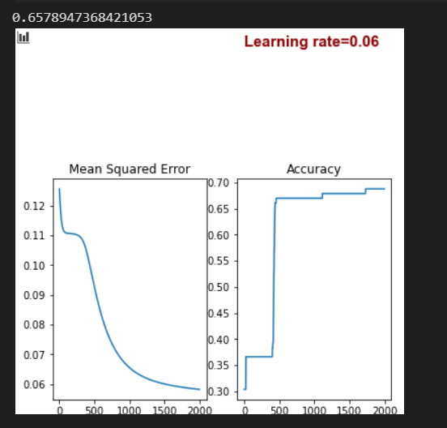

# Describtion for Function of Algorithm
## Helper Function 

> **Acctivation Function**

> **Function that Plot accuracy and MSE at each epoch . its argumend is data frame contain two column ,one for loss function through each epoch and another for accuracy through also each epoch** 

> **Function that plot accuracy of train and test through train set size ,so it shows difference in accuracy in train and test set**

## Class of NetWork

* here initialize each layer as list contains in the first index the initialization of weights matrix for this layer .which number of nodes for previous layer is equal to number of rows for weight matrix and   number of node in next layer equal to number of columns in weights matrix 

* the secand index for list is velosity for momentum when i activate this term and i showe the equation that i used later in thie report . i use it in equation 

* the second index is activation function to output of layer 

* fit function use gradient descent in optimization and at each epoch shuffle data where implementation of shuffle function as shown in image
* after shuffling data at each epoch call forward propagation function to fit X and activation function at each layer  and call backpropagation function to optimize weights on this output from activation function in forward function 

* contain momentum argument that can i activate it by send to this function true ,and momentum factor

* here i calculate activation function for each layer as i mentioned above

* bachpropagation function depends on activation function that i calculated in forward function
* at the first , i calculated the error for the last layer that is stored in activatons list from forward propagation function 
* propagating the error from each layer to the previous one. 
* if momentum true so weights will update depends on equation below

> beta is momentum vector

* i call this function in back probagtion function that calculate MSE and accuracy at each epoch to monitor performace of algorithm and store these two values in data frame to use this frame in plotting cost function with iterations 

* these function to measure accuracy and MSE(cost function)

* predict_prob function that predict output of Neural network with floats numbers
* so in predict function just i round each value in predication to zero or one depend on threshold value

# Equation I used in BackPropagation Algorithm

###  **To predict output of activation function** 

> weight matrix contains bais vector 

###  **To Minimize Loss Function , differentiate it w.r.t weight of each layer** 

> **Thats what i tried to implement**
#   Prepare each data

* here i split classes that is in target or class column to number of columns equal to number of classes and split data to 70 /30 

* Here when i call my algorthm and the first argument  [n_hidden]is  number of hidden layer and number of node for each layer

# **``Iris Data``**
# Graph for Performance of Algorithm at different Learning Rate 
**Using 7 node for hidden layer**

### *at lr= 0.03*
### Graph for performance of traning set through epochs

### Graph of performance of train and test accuracy

> There are a big variance between tran and test set in Accuracy

### *at lr= 0.06*
### Graph for performance of traning set through epochs

### Graph of performance of train and test accuracy

> Here also is not the best senareo

### *at lr= 0.05*
### Graph of performance of train and test accuracy

> There are a big variance between tran and test set in Accuracy

### *at lr= 0.08*
### Graph for performance of traning set through epochs

### Graph of performance of train and test accuracy

> Here ,It is good performance

### *at lr= 0.09*
### Graph of performance of train and test accuracy

> Here IT is worse

### *at lr= 0.1*
### Graph for performance of traning set through epochs

### Graph of performance of train and test accuracy

> **So, at lr=0.08 or .1 , are the best performance**

#### **I Select lr=0.1**

# Graph for Performance of Algorithm at different numbers of nodes for hidden layer and lr=0.1
### *at n=1*
### Graph for performance of traning set through epochs

### Graph of performance of train and test accuracy

> test set accuracy =0.533 and train acc=0.75, big variance 

### *at n=2*
### Graph for performance of traning set through epochs

> test set accuracy =0.8 and train acc=0.95, big variance 
### *at n=3*
### Graph for performance of traning set through epochs

### Graph of performance of train and test accuracy

> test set accuracy =0.66 and train acc=0.99, big variance 

### *at n=4*
### Graph for performance of traning set through epochs

### Graph of performance of train and test accuracy

> test set accuracy =0.93 and train acc=0.98, it is very good

### *at n=5*
### Graph for performance of traning set through epochs

### Graph of performance of train and test accuracy

> test set accuracy =0.93 and train acc=0.98, it is similar to n=4

>##  **So I Select numbers of hidden nodes =4 and lr =0.1**

# **``Vowel Data``**
# Graph for Performance of Algorithm at different Learning Rate 
**Using 7 node for hidden layer**
### *at lr= 0.03*
### Graph of performance of Loss function and accuracy

 
> here Train accuracy=0.98 and test accuracy= 0.6 , big valiance 

### *at lr= 0.05*
### Graph of performance of Loss function and accuracy

> it is very good , train accuracy is =0.98 and test accuracy =0.93 

### *at lr= 0.06*
### Graph of performance of Loss function and accuracy

> it is similar to lr= 0.05

>### **I select lr=0.06**

# Graph for Performance of Algorithm at different numbers of nodes for hidden layer and lr=0.05

### *at n=1*
### Graph for performance of traning set through epochs

> accuracy of train is about 0.99 and test set is 0.6

### *at n=2*
### Graph for performance of traning set through epochs

> accuracy of train is about 0.95 and test set is 0.78

### *at n=3*
### Graph for performance of traning set through epochs

> accuracy of train is about 0.99 and test set is 0.89

### *at n=4*
### Graph for performance of traning set through epochs

> accuracy of train is about 0.98 and test set is 0.92, it is very good

>##  **So I Select numbers of hidden nodes =4 and lr =0.05**

# 2-hidden layer neural network

> At 4000 epochs ,accuracy of test set is =0.65 and train set is about 0.7

# Using Momentum On ``Iris Data`` 
### at number of hidden layer nodes =4 and learning rate =0.08 

> I change here function of optimization from gradiant descent to mini batch stochastic gradient descent , and mini batch size is =10
* not big difference in result , just i did it to expriment
* here impelementation for this part 

> **Accuracy with momentm is very good , 0.97 in test set and in train set about 0.99**

# Using Momentum On ``Vowel Data`` 
### at number of hidden layer nodes =4 and learning rate =0.05

> **Accuracy also in this data with momentm is very good , 0.97 in test set and in train set about 0.99**

# Part five i discussed  every Point with graphs